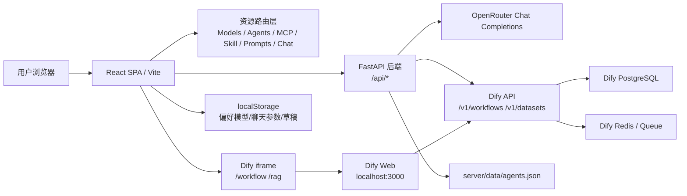
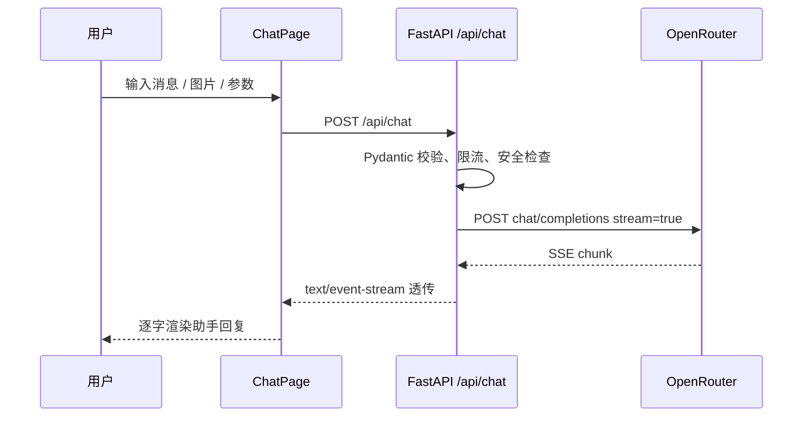
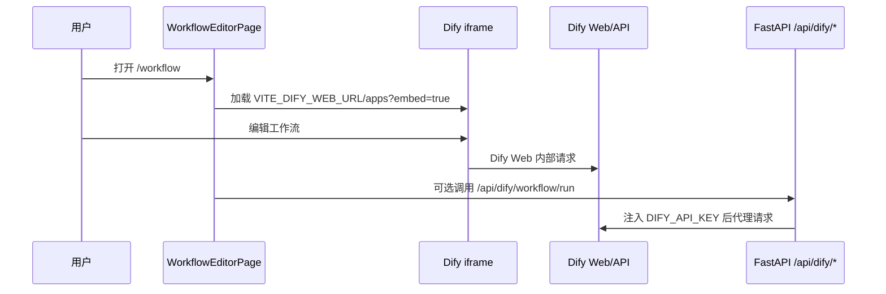

# 项目整体架构

## 项目愿景

模镜 ModelMirror 是 AI 基础设施的发现与协作层。它把模型、智能体、MCP、Skill、提示词、工作流和 RAG 资料库放在同一个浏览器式产品里，让用户能先“逛资源”，再“面试模型”，最后把资源组合成可运行的 AI 工作台。

当前稳定版本采用“前端自研资源浏览 + 后端统一代理 + Dify 承载工作流/RAG”的架构。工作流和知识库不再贸然自研替换，直到新的原生引擎完成分阶段验证。

## 技术选型理由

| 技术 | 用途 | 选择理由 |
| --- | --- | --- |
| React + TypeScript | 前端 SPA | 组件化清晰，类型约束强，适合资源浏览与复杂聊天页面。 |
| Tailwind CSS | 样式系统 | 可快速实现主题化 UI，避免引入重型 UI 库。 |
| Vite | 构建工具 | 本地开发快，配置轻。 |
| React Router v6 | 路由 | 与 SPA 页面结构匹配，当前所有功能以路由划分。 |
| React Flow | 经典自研工作流画布 | 保留 MVP 实验入口，不承载主路径稳定能力。 |
| FastAPI + Pydantic | 后端代理 | 异步流式响应友好，类型校验清晰。 |
| httpx | 外部 API 调用 | 支持异步流式转发。 |
| Dify 社区版 | 工作流与 RAG | 成熟的工作流引擎和知识库管道，降低自研风险。 |

## 系统架构图

## 页面路由与功能模块

| 路由 | 页面组件 | 功能 |
| --- | --- | --- |
| `/` | `Navigate` | 重定向到 `/models`。 |
| `/models` | `ModelListPage` | 模型招聘会，含筛选、模型卡片、聊天入口。 |
| `/agents` | `AgentsPage` | AI 人才市场，展示智能体与平台能力卡片。 |
| `/expert-team` | `ExpertTeamPage` | 专家团入口，包含 Fusion、自动路由、AI Team。 |
| `/mcps` | `McpBrowserPage` | MCP 工具采购，展示首批 MCP 项目。 |
| `/skills` | `SkillBrowserPage` | Skill 技能货架，展示首批 Skill 项目。 |
| `/prompts` | `ComingSoonPage` | 提示词市场占位。 |
| `/chat/:modelId` | `ChatPage` | 面试间，支持文本、多模态、提示词助手和高级参数。 |
| `/workflow` | `WorkflowEditorPage` | Dify 工作流 iframe 稳定入口。 |
| `/workflow/new` | `WorkflowEditorPage` | 兼容旧入口，仍显示 Dify 工作流。 |
| `/workflow/:id` | `WorkflowEditorPage` | 兼容旧入口，仍显示 Dify 工作流。 |
| `/workflow/classic` | `WorkflowClassicPage` | 经典自研 React Flow 实验画布。 |
| `/rag` | `RagPage` | Dify 知识库 iframe 稳定入口。 |
| `/studio` | `StudioHomePage` | 工作台总览，说明当前 Dify 稳定路径。 |

## 主要数据流

### 聊天流式调用

### Dify 工作流入口

## 外部依赖

- OpenRouter：模型统一网关，后端通过 `OPENROUTER_API_KEY` 调用。
- Dify：工作流和知识库稳定承载服务，前端 iframe 嵌入，后端通过 `/api/dify/*` 代理。
- GitHub：用于代码版本控制和未来项目数据同步。

## 当前风险边界

- `client/src/data/*.ts` 中仍有大量静态资源数据，数据更新需人工或脚本同步。
- Dify iframe 是否可嵌入取决于本地 Dify Web 配置；若 CSP/X-Frame-Options 阻止嵌入，需要走 Dify Web 直开或 API 驱动回退。
- 自研工作流只保留在 `/workflow/classic`，不能替代稳定 `/workflow`。

最后更新日期：2026-06-10  
维护人：模镜团队
