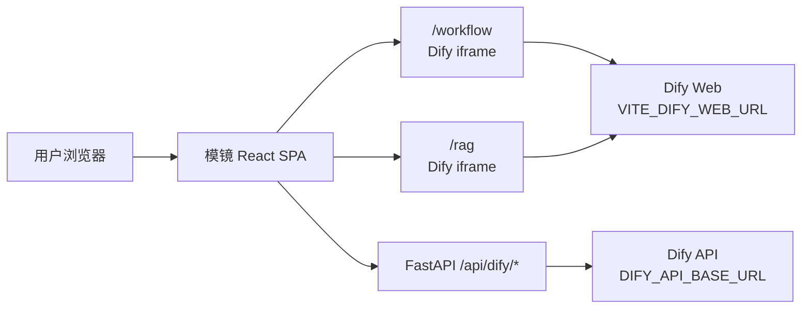

# Dify 集成方案详解

## 为什么选择 Dify

Dify 已经提供成熟的工作流引擎、知识库 RAG、应用发布和调试能力。模镜当前的核心价值是“AI 资源发现与组合入口”，因此稳定版本选择集成 Dify，而不是在主路径上立即自研替代。

这次 P0 回退后，原则更明确：`/workflow` 和 `/rag` 保持 Dify 稳定入口，自研功能只能在独立实验路由中逐步验证。

## 集成架构



## 前端 iframe

组件：

```text
client/src/components/dify/DifyWorkspaceFrame.tsx
```

页面：

- `client/src/pages/WorkflowEditorPage.tsx`
- `client/src/pages/RagPage.tsx`

环境变量：

```bash
VITE_DIFY_WEB_URL=http://localhost:3000
```

iframe URL 会附加：

```text
?embed=true&hide_nav=true&source=modelmirror
```

这些参数用于表达嵌入意图；是否生效取决于 Dify Web 当前版本。若 Dify 不支持隐藏导航，仍可作为完整 iframe 工作台使用。

## 后端代理

文件：

```text
server/api/dify_proxy.py
```

挂载：

```python
from api.dify_proxy import router as dify_router
app.include_router(dify_router)
```

### GET `/api/dify/health`

检查本地配置：

```bash
curl http://localhost:8000/api/dify/health
```

### GET `/api/dify/apps`

转发到 Dify App 列表接口，需 `DIFY_API_KEY`。

### POST `/api/dify/workflow/run`

转发到：

```text
POST {DIFY_API_BASE_URL}/workflows/run
```

默认注入：

```json
{"response_mode":"streaming"}
```

### 通用代理

```text
/api/dify/{path:path}
```

用于临时补齐其他 Dify API。使用时需谨慎，避免把 Dify 内部错误直接暴露给用户。

## Dify 部署步骤

1. 按 Dify 官方文档启动社区版 Docker Compose。
2. 打开 `http://localhost:3000` 完成初始化。
3. 创建模镜工作空间。
4. 创建应用或工作流，启用 API 访问。
5. 复制 App API Key 到 `server/.env`：

```bash
DIFY_API_BASE_URL=http://localhost:5001/v1
DIFY_API_KEY=app-your-key
```

6. 前端 `.env`：

```bash
VITE_DIFY_WEB_URL=http://localhost:3000
```

## 模型路由打通

在 Dify 中配置 OpenAI Compatible Provider：

- Base URL：`https://openrouter.ai/api/v1`
- API Key：使用服务端 OpenRouter Key 或 Dify 专用 Key
- Model：按 Dify 后台支持方式添加

这样 Dify 工作流内部调用模型时，也能通过同一模型网关走 OpenRouter。

## postMessage 和主题注入

当前实现只做 iframe 嵌入和新窗口 fallback，尚未实现复杂 postMessage 协议。

未来可扩展：

- 模镜向 Dify iframe 发送跳转事件。
- Dify 完成工作流保存后通知模镜刷新侧边栏。
- 通过 CSS 变量或 Dify 配置同步模镜主题色。

## 常见问题

### iframe 空白

检查：

```bash
curl -I http://localhost:3000
```

如果 Dify 设置了 `X-Frame-Options` 或 CSP 禁止嵌入，可点击页面中的“新窗口打开”。

### `/api/dify/health` 返回 missing_api_key

说明 `DIFY_API_KEY` 未配置。填写 `server/.env` 后重启后端。

### 工作流运行 401

检查 Dify App API Key 是否属于当前应用，且是否包含工作流运行权限。

### Dify API 地址不对

确认：

```bash
DIFY_API_BASE_URL=http://localhost:5001/v1
```

不要把 Web 地址 `http://localhost:3000` 填到后端 API 变量里。

## 未来替代路线

自研路线见 [retry-plan-workflow-native.md](./retry-plan-workflow-native.md)。核心原则：

- 不替换 `/workflow` 和 `/rag`。
- 先做设计和测试。
- 自研版本使用独立路由。
- 每个节点能力逐个交付。

最后更新日期：2026-06-10  
维护人：模镜团队
